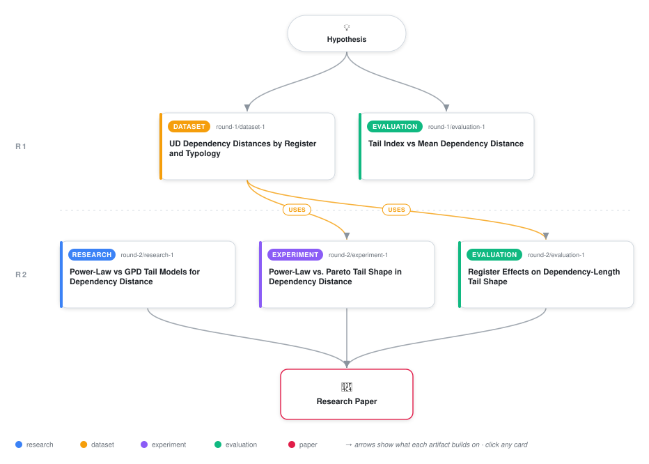

# Tail Risk in Dependency Distance: A Generalized Pareto Analysis Across 18 Language Treebanks

<div align="center">

<a href="https://cdn.jsdelivr.net/gh/ai-inventor-papers/ai-invention-544c17-language-minimizes-dependency-distance@main/workflow.svg">
<picture>
  <source media="(prefers-color-scheme: dark)" srcset="workflow-dark.svg">
  
</picture>
</a>

<sub>🖱️ <b><a href="https://cdn.jsdelivr.net/gh/ai-inventor-papers/ai-invention-544c17-language-minimizes-dependency-distance@main/workflow.svg">Open the interactive diagram</a></b> — every card links to its artifact folder.</sub>

</div>

> **TL;DR** — This paper establishes the Generalized Pareto shape parameter ξ as a new, robust typological statistic for characterizing dependency-length distributions across 18 UD treebanks. ξ carries orthogonal information to mean dependency distance, correlates with head-finality typology 1.9× more strongly, and generalizes well across language families (LOFO RMSE 0.067). Register (spoken vs. written) effects are directionally consistent at the matched-pair level (3 of 4 pairs significant after Holm correction) but do not reach population-level significance (p=0.27 Holm-corrected) and reverse at higher percentile thresholds, indicating threshold sensitivity and genre confounds. Comparison to power-law exponents shows ξ predicts register better in regression models despite high mathematical correlation (α ≈ 1/ξ). However, power-law models actually fit the data better in 12 of 18 treebanks, suggesting that two-regime models may be more appropriate. The work reframes dependency-distance minimization as both a central-tendency and risk-management phenomenon, with honest acknowledgment of limitations and caveats.

<details>
<summary>Full hypothesis</summary>

Dependency distance minimization (DDM) is only partly captured by mean dependency distance (MDD): the Generalized Pareto peaks-over-threshold shape parameter ξ, fitted to sentence-length-normalized dependency lengths across 18 UD treebanks (4 matched spoken/written pairs: Slovenian, French, English, Turkish; plus 14 additional typologically diverse treebanks), is a statistically distinguishable, non-redundant descriptor of a treebank's dependency-length distribution -- it correlates with head-finality more strongly than MDD does (partial ρ=-0.55 vs -0.29) and generalizes across families under leave-one-family-out cross-validation (macro RMSE 0.067 vs MDD's 0.51) -- but this iteration's evidence sharpens two important qualifications beyond the prior tier split. First, ξ's superiority over MDD does NOT extend to superiority over the pre-existing power-law tail exponent α from the Ferrer-i-Cancho line: α and ξ are near-reciprocal parameterizations of the same tail data (Spearman ρ=-0.73, Pearson r²=0.49), and a direct goodness-of-fit comparison shows power-law fits the tail better than GPD by AIC in 12/18 treebanks (67%), with the two-regime exponential/power-law breakpoint model (Petrini & Ferrer-i-Cancho) a plausible superior alternative to either single-regime fit. ξ nonetheless outpredicts α specifically for register classification in mixed-effects models (AICc 26.7 vs 63.4), an asymmetry that itself needs scrutiny since it may reflect ξ's wider numeric range rather than genuine independent information. Second, the register (spoken-lighter-tail) claim is now more precisely bounded, not merely 'unresolved': a corrected decile-matched (not arc-level) analysis shows a significant spoken-lighter effect in only 2 of 4 matched pairs surviving Holm correction (Slovenian p_Holm=0.028, French p_Holm=0.020; English and Turkish non-significant, English's raw direction even reversed), the four-pair paired t-test on ξ is not significant (p=0.156), the population-level correlation between register and ξ across all measured treebanks is not significant after correction (ρ=-0.52, p_Holm=0.27), and the effect's sign reverses at the 90th-percentile threshold -- collectively indicating that if a spoken-lighter-tail effect exists at all, it is a moderate-tail, threshold-dependent, family/genre-confounded phenomenon rather than a robust deep-tail signature, and current evidence does not distinguish a true register effect from genre heterogeneity (task-oriented Turkish ATIS vs. conversational Slovenian SST) or from register-label coarseness. The revised claim remains two-tiered but the tiers are now: (a) CONFIRMED — ξ is a genuine, non-redundant, typologically-generalizable descriptor of dependency-length distributions, orthogonal to and stronger than MDD for typological correlation, though its practical tail-fit superiority over the established power-law exponent is NOT established (indeed power-law fits better on raw AIC in most treebanks) and its main demonstrated edge is discriminating register in a regression sense, not out-fitting the data; (b) NOT CONFIRMED, and now more precisely characterized as bounded rather than merely small-n-limited — a directional spoken-lighter-tail effect appears in roughly half of matched pairs at moderate thresholds and vanishes at extreme thresholds and at the population level, so any register claim in the paper must be reported as a scoped, direction-inconsistent finding rather than a general regularity, pending larger, genre-matched, and (ideally) two-regime-aware register comparisons. A necessary further step, beyond the head-finality partial correlations already computed, is to test formally (e.g. via a bootstrap difference-of-dependent-correlations, not just a point-estimate ratio) whether ξ's head-finality correlation is reliably stronger than MDD's, since the 1.9x ratio was reported at n=18 without such a test.

</details>

[](https://ai-inventor-papers.github.io/ai-invention-544c17-language-minimizes-dependency-distance/)

[](https://cdn.jsdelivr.net/gh/ai-inventor-papers/ai-invention-544c17-language-minimizes-dependency-distance@main/paper.pdf) [](https://github.com/ai-inventor-papers/ai-invention-544c17-language-minimizes-dependency-distance/tree/main/paper_latex)

This repository contains all **5 artifacts** produced across **2 rounds** of an autonomous AI research run — round by round, exactly in the order they were invented.

## Round 1

| Artifact | Type | Demo | Source | Builds on |
|----------|------|------|--------|-----------|
| **[UD Dependency Distances by Register and Typology](https://github.com/ai-inventor-papers/ai-invention-544c17-language-minimizes-dependency-distance/tree/main/round-1/dataset-1)** | [](https://github.com/ai-inventor-papers/ai-invention-544c17-language-minimizes-dependency-distance/tree/main/round-1/dataset-1) | [](https://colab.research.google.com/github/ai-inventor-papers/ai-invention-544c17-language-minimizes-dependency-distance/blob/main/round-1/dataset-1/demo/data_code_demo.ipynb) | [](https://github.com/ai-inventor-papers/ai-invention-544c17-language-minimizes-dependency-distance/tree/main/round-1/dataset-1/src) | — |
| **[Tail Index vs Mean Dependency Distance](https://github.com/ai-inventor-papers/ai-invention-544c17-language-minimizes-dependency-distance/tree/main/round-1/evaluation-1)** | [](https://github.com/ai-inventor-papers/ai-invention-544c17-language-minimizes-dependency-distance/tree/main/round-1/evaluation-1) | [](https://colab.research.google.com/github/ai-inventor-papers/ai-invention-544c17-language-minimizes-dependency-distance/blob/main/round-1/evaluation-1/demo/eval_code_demo.ipynb) | [](https://github.com/ai-inventor-papers/ai-invention-544c17-language-minimizes-dependency-distance/tree/main/round-1/evaluation-1/src) | — |

## Round 2

| Artifact | Type | Demo | Source | Builds on |
|----------|------|------|--------|-----------|
| **[Power-Law vs GPD Tail Models for Dependency Distance](https://github.com/ai-inventor-papers/ai-invention-544c17-language-minimizes-dependency-distance/tree/main/round-2/research-1)** | [](https://github.com/ai-inventor-papers/ai-invention-544c17-language-minimizes-dependency-distance/tree/main/round-2/research-1) | [](https://github.com/ai-inventor-papers/ai-invention-544c17-language-minimizes-dependency-distance/blob/main/round-2/research-1/demo/research_demo.md) | [](https://github.com/ai-inventor-papers/ai-invention-544c17-language-minimizes-dependency-distance/tree/main/round-2/research-1/src) | — |
| **[Power-Law vs. Pareto Tail Shape in Dependency Distance](https://github.com/ai-inventor-papers/ai-invention-544c17-language-minimizes-dependency-distance/tree/main/round-2/experiment-1)** | [](https://github.com/ai-inventor-papers/ai-invention-544c17-language-minimizes-dependency-distance/tree/main/round-2/experiment-1) | [](https://colab.research.google.com/github/ai-inventor-papers/ai-invention-544c17-language-minimizes-dependency-distance/blob/main/round-2/experiment-1/demo/method_code_demo.ipynb) | [](https://github.com/ai-inventor-papers/ai-invention-544c17-language-minimizes-dependency-distance/tree/main/round-2/experiment-1/src) | <sub><i>uses:</i><br/>[dataset‑1&nbsp;(R1)](https://github.com/ai-inventor-papers/ai-invention-544c17-language-minimizes-dependency-distance/tree/main/round-1/dataset-1)</sub> |
| **[Register Effects on Dependency-Length Tail Shape](https://github.com/ai-inventor-papers/ai-invention-544c17-language-minimizes-dependency-distance/tree/main/round-2/evaluation-1)** | [](https://github.com/ai-inventor-papers/ai-invention-544c17-language-minimizes-dependency-distance/tree/main/round-2/evaluation-1) | [](https://colab.research.google.com/github/ai-inventor-papers/ai-invention-544c17-language-minimizes-dependency-distance/blob/main/round-2/evaluation-1/demo/eval_code_demo.ipynb) | [](https://github.com/ai-inventor-papers/ai-invention-544c17-language-minimizes-dependency-distance/tree/main/round-2/evaluation-1/src) | <sub><i>uses:</i><br/>[dataset‑1&nbsp;(R1)](https://github.com/ai-inventor-papers/ai-invention-544c17-language-minimizes-dependency-distance/tree/main/round-1/dataset-1)</sub> |

## Repository Structure

Artifacts are grouped by the round of invention that produced them. Each
artifact has its own folder with source code and a self-contained demo:

```
.
├── round-1/                         # One folder per round of invention
│   ├── experiment-1/
│   │   ├── README.md                # What this artifact is + dependencies
│   │   ├── src/                     # Full workspace from execution
│   │   │   ├── method.py            # Main implementation
│   │   │   ├── method_out.json      # Full output data
│   │   │   └── ...                  # All execution artifacts
│   │   └── demo/                    # Self-contained demo
│   │       └── method_code_demo.ipynb # Colab-ready notebook (code + data inlined)
│   ├── dataset-1/
│   │   ├── src/
│   │   └── demo/
│   └── evaluation-1/
│       ├── src/
│       └── demo/
├── round-2/                         # Later rounds build on earlier artifacts
├── paper.pdf                        # Research paper
├── paper_latex/                     # LaTeX source files
├── chat/                            # Every prompt, response and tool call, per module
├── workflow.svg                     # Artifact dependency diagram (this page's header)
└── README.md
```

## Running Notebooks

### Option 1: Google Colab (Recommended)

Click the "Open in Colab" badges above to run notebooks directly in your browser.
No installation required!

### Option 2: Local Jupyter

```bash
# Clone the repo
git clone https://github.com/ai-inventor-papers/ai-invention-544c17-language-minimizes-dependency-distance
cd ai-invention-544c17-language-minimizes-dependency-distance

# Install dependencies
pip install jupyter

# Run any artifact's demo notebook
jupyter notebook <artifact_folder>/demo/
```

## Source Code

The original source files are in each artifact's `src/` folder.
These files may have external dependencies - use the demo notebooks for a self-contained experience.

---
*Generated by AI Inventor Pipeline - Automated Research Generation*
